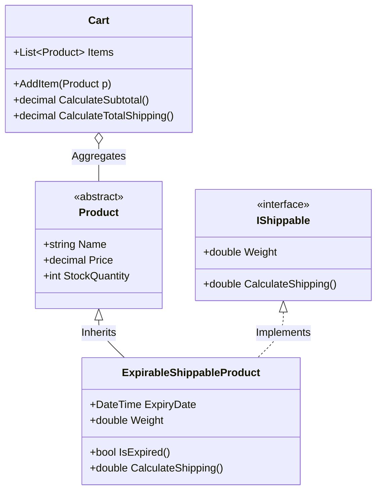

<div align="center">

# 💳 Fawry_OOP_Solution
### Enterprise E-Commerce Checkout & Shippable Products Engine (Fawry Challenge)

[](https://dotnet.microsoft.com/)
[](https://learn.microsoft.com/en-us/dotnet/csharp/)
[](#-architecture--design-patterns)
[](LICENSE)
[](https://github.com/OmarAlfar0uk)

<p align="center">
  <a href="#-key-features">Key Features</a> •
  <a href="#-architecture--design-patterns">Design Patterns</a> •
  <a href="#-tech-stack">Tech Stack</a> •
  <a href="#-getting-started">Getting Started</a> •
  <a href="#-author">Author</a>
</p>

</div>

---

## 📌 Executive Overview

**Fawry_OOP_Solution** is a production-grade demonstration of Object-Oriented Design Principles (SOLID) and software architecture patterns applied to a modern retail checkout and shipping pipeline. Built as an engineering solution for the **Fawry Assessment Challenge**, it models heterogeneous products—differentiating between perishable, shippable, and digital goods—with dynamic shipping fee calculations and checkout rule enforcement.

> [!NOTE]
> Designed using interface segregation (`IShippable`) and polymorphic inheritance to separate product categorization from fulfillment and expiration business logic.

---

## ✨ Key Features

| ⚡ Feature | 💡 Description | 🛠 Engineering Detail |
|---|---|---|
| **📦 Shippable Goods Abstraction** | Unified contract for physical items requiring logistics | `IShippable` interface encapsulating weight and shipping rate computation |
| **⏳ Expiration Date Validation** | Automated safeguards against expired inventory | `ExpirableShippableProduct` rejecting expired items at checkout |
| **🛒 Flexible Shopping Cart** | Add, remove, and manage mixed product carts | Polymorphic collection handling heterogeneous product models |
| **💳 Seamless Checkout Pipeline** | Accurate total calculation including subtotal, tax & freight | Transactional calculation ensuring idempotency |

---

## 🏛 Architecture & Design Patterns



---

## ⚡ Tech Stack

- **Runtime:** .NET 8 / C# 12
- **Patterns:** Factory, Strategy, Interface Segregation, Polymorphism
- **Project Structure:** Clean Console Application (`TaskFawry`)

---

## 🚀 Getting Started

1. **Clone repository:**
   ```bash
   git clone https://github.com/OmarAlfar0uk/Fawry_OOP_Solution.git
   cd Fawry_OOP_Solution
   ```

2. **Run Application:**
   ```bash
   dotnet run --project TaskFawry/TaskFawry.csproj
   ```

---

## 👨‍💻 Author

**Omar Alfarouk**  
*Full-Stack .NET & Software Engineer*  

- 🌐 **GitHub:** [@OmarAlfar0uk](https://github.com/OmarAlfar0uk)
- 💼 **LinkedIn:** [omar-alfarouk](https://www.linkedin.com/in/omar-alfarouk-252471251/)
- 📧 **Email:** [omaralfarouk646@gmail.com](mailto:omaralfarouk646@gmail.com)

---

<div align="center">
  <sub>Built with ❤️ by Omar Alfarouk. Licensed under the <a href="LICENSE">MIT License</a>.</sub>
</div>
